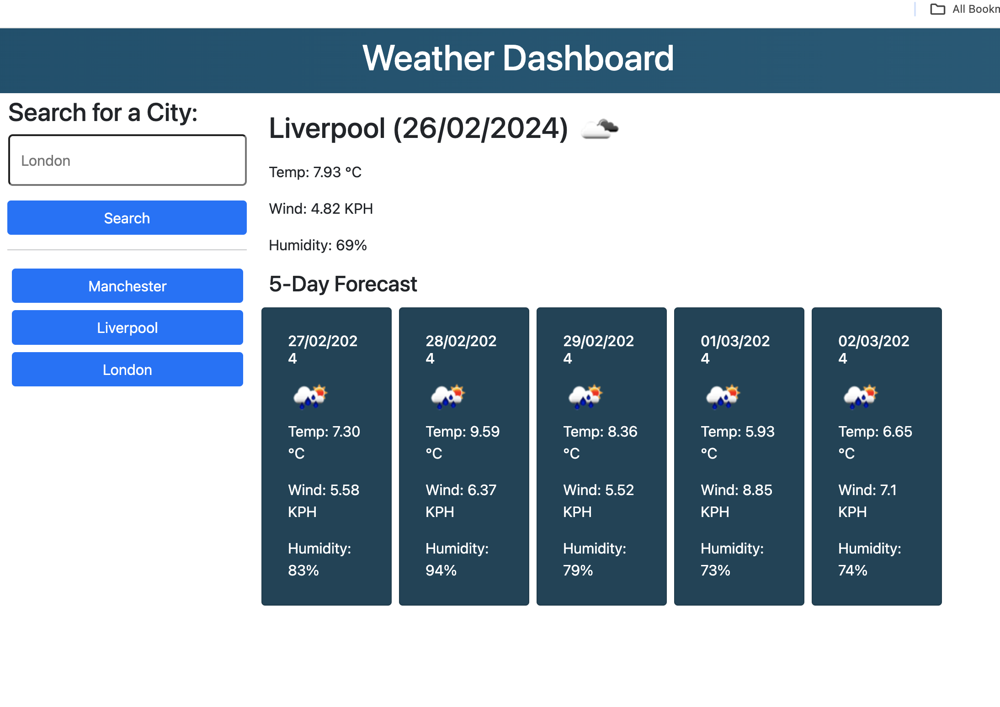

# Weather Dashboard

## Description

A 5 day weather forecast created using open weather api that allows users to search and display current weather forecast for a given location. This application runs in the browser and features dinamically updated HTML and CSS.

## Table of Contents

- [Demo](#demo)
- [Features](#features)
- [Usage](#usage)
- [Installation](#installation)
- [Links](#links)

## Demo

Link to live demo can be found here:

## Features

1. **Search for Location:** Enter the name of a city or location to get the current weather and 5-day forecast.

2. **Dynamic Weather Dashboard:** The dashboard dynamically updates to display the current weather and forecast for the entered location.

3. **5-day Forecast:** View a detailed 5-day forecast, including temperature, wind speed, and humidity.

4. **Search History:** Previously searched locations are saved in the search history area for easy access. Clicking on a history item will display the weather for that location.

5. **Responsive Design:** The app is designed to be responsive, ensuring a good user experience on various devices.

6. **Local Storage:** Utilizes local storage to store and retrieve the search history, providing a seamless experience even after refreshing the page.

7. **Error Handling:** Provides error messages for scenarios such as invalid locations or API request failures.

8. **Clear UI:** The user interface is clear and intuitive, making it easy for users to interact with the app.

9. **OpenWeatherMap Integration:** Uses the OpenWeatherMap API to fetch accurate and up-to-date weather data.

## Usage

* __Search for a Location__: Enter a location in the search input and click the search button.

* __View Weather__: The app will display the current weather and a 5-day forecast for the entered location.

* __Search History__: Previously searched locations are saved in the search history area for quick access.

## Installation

There is no specific installation required for this application. Simply clone the repository and open the `index.html` file in a web browser.

## Links

https://github.com/shkendi/Weather-App